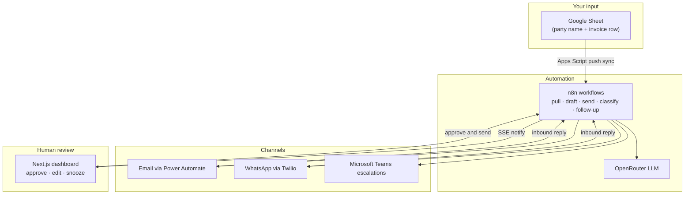

# Dunnly

**Dunnly** is an accounts-receivable autopilot. Add a party name and invoice details to the Google Sheet ledger — the system pulls overdue rows, drafts email + WhatsApp reminders with AI, waits for your approval, sends, reads replies, classifies them, escalates disputes to Teams, and schedules follow-ups until payment. You stay in the loop at the moments that matter; the machine handles everything else.

## The sweet spot

Dunnly is designed for the human-in-the-loop review situation where automation helps without hurting the business:

- **`AUTO_SEND=false` by default** — every outbound message requires dashboard approval
- **Follow-up scheduler redrafts** due rows daily; it never auto-sends
- **Operators** can edit drafts, snooze or pause cadence, attach unmatched inbound replies, and close accounts
- **AI** handles drafting and classification; **humans** handle judgment calls

## How it works



**Live architecture:**

- **Dashboard:** Next.js app on Vercel — SSE push sync (no background polling)
- **Backend:** n8n workflows (import from `n8n/workflows/`)
- **Ledger:** Google Sheets → Apps Script push → n8n cache → dashboard notify

See [n8n/README.md](n8n/README.md) for the webhook contract and full backend setup.

## For operators

| Step | What you do |
|---|---|
| 1 | Add or edit a row in the Sheet: customer name, amount, `dateOfSupply`, `creditDays`, email, phone |
| 2 | Open the dashboard → **RUN PULL** (or wait for the daily follow-up scheduler to redraft due rows) |
| 3 | Review AI drafts in the **ACTION** tab → edit if needed → **APPROVE & SEND** |
| 4 | Watch the pipeline: `queued → drafted → sent → replied → classified → notified` |
| 5 | Handle the **INBOUND** tab for unmatched replies; use cadence controls to snooze, pause, or close |

**Sheet setup:** [n8n/docs/google-sheets-push-sync.md](n8n/docs/google-sheets-push-sync.md)

## Quick start (local)

```bash
npm install
npm run dev
```

Leave `N8N_BASE_URL` unset to run against the built-in mock backend ([`lib/store.ts`](lib/store.ts)). No other env vars are required for mock mode.

## For developers and coding agents

### Repo map

| Path | Purpose |
|---|---|
| [`app/`](app/) | Next.js dashboard + API proxy to n8n |
| [`lib/store.ts`](lib/store.ts) | Mock ledger (default when `N8N_BASE_URL` is unset) |
| [`lib/n8n.ts`](lib/n8n.ts) | Live backend client |
| [`lib/followup-policy.ts`](lib/followup-policy.ts) | Cadence state machine (TypeScript mirror of n8n JS) |
| [`n8n/workflows/`](n8n/workflows/) | Importable n8n workflow JSON |
| [`n8n/followup-policy.js`](n8n/followup-policy.js) | Canonical cadence logic (synced into workflows) |
| [`evals/`](evals/) | LLM prompt quality harnesses |
| [`scripts/`](scripts/) | Deploy, sync, probe, and eval runners |
| [`n8n/README.md`](n8n/README.md) | Webhook contract + full backend setup |
| [`CLAUDE.md`](CLAUDE.md) | Agent skill routing for this repo |

### Modes

- **Mock:** `npm install && npm run dev` — no env vars needed
- **Live:** set `N8N_BASE_URL` and `N8N_WEBHOOK_SECRET` in `.env` (copy from [`.env.example`](.env.example))

### Common commands

```bash
npm run dev                                    # local dashboard (mock or live)
node scripts/push-n8n-workflows.js             # deploy workflows to n8n
node scripts/probe-sheet-sync.js --bootstrap   # bootstrap sheet → n8n sync
npm run eval:wa-draft                          # run WhatsApp draft evals
npm run eval:classify-reply                    # run classify evals
node scripts/build-followup-workflow.js        # regenerate follow-up workflow from policy JS
```

### Agent rules — do NOT commit

- `.env`, `.env.local`, `pa-invoke-urls.env`, Twilio credential files
- Debug scripts (`scripts/_debug-*`, `scripts/debug-*`)
- Demo and internal docs (`DEMO-*.md`, `TODOS.md`)
- Agent local config (`.claude/`, `.cursor/`)
- Generated artifacts (`*.tsbuildinfo`, `evals/**/results/*.json`)
- Live workflow overrides (`n8n/workflows/dunnly-send.live.json`)

**When changing prompts or shared JS:** edit the source in `evals/` or `n8n/*.js`, then run the matching `scripts/sync-*.js` before `push-n8n-workflows.js`.

## Environment

Copy [`.env.example`](.env.example) to `.env` and set:

| Variable | Purpose |
|---|---|
| `N8N_BASE_URL` | n8n instance URL (unset = mock mode) |
| `N8N_WEBHOOK_SECRET` | Header `x-dunnly-secret` for n8n webhooks |
| `N8N_WEBHOOK_PREFIX` | `/webhook` for production; `/webhook-test` for editor testing |
| `AUTO_SEND` | Default `false` — manual approve/send |
| `TWILIO_*` | Optional WhatsApp sandbox settings for local smoke tests |

n8n-host-only variables (Power Automate URLs, Teams webhooks, follow-up scheduler) live on the n8n server — see [n8n/docs/oracle-cloud-n8n-env.md](n8n/docs/oracle-cloud-n8n-env.md).

Never commit `.env` or files containing Power Automate invoke URLs.
